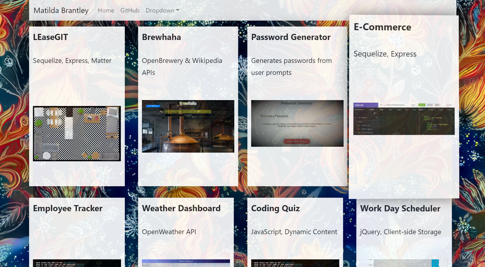
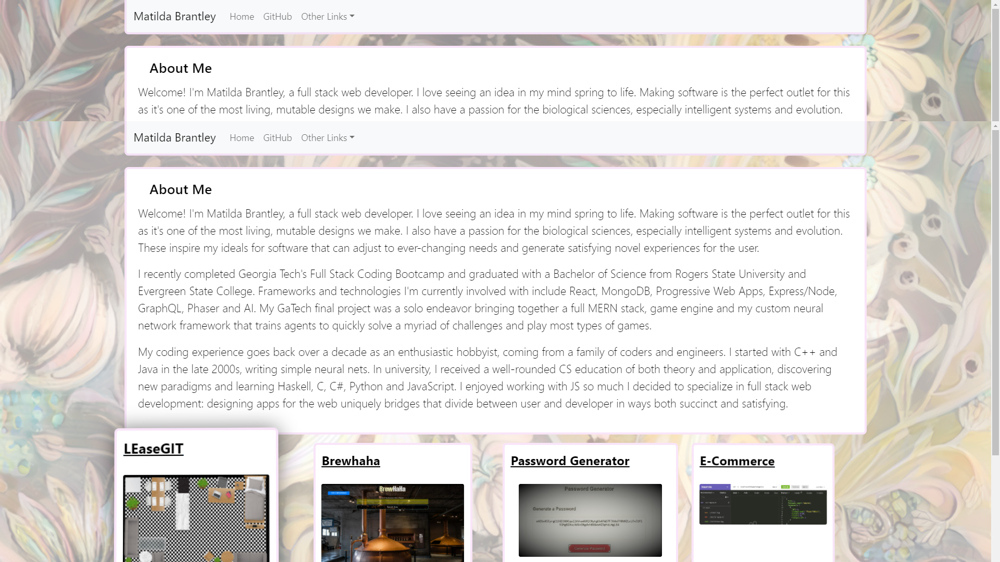
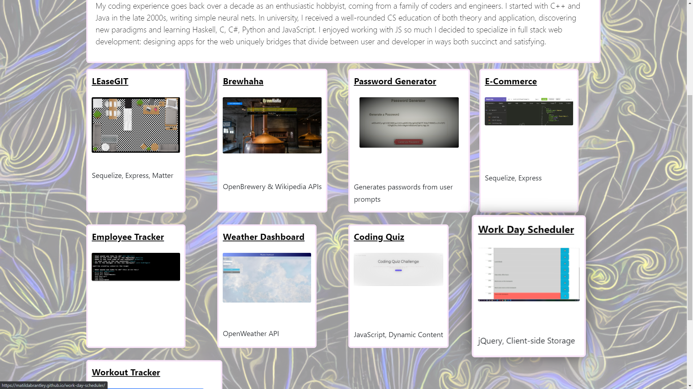
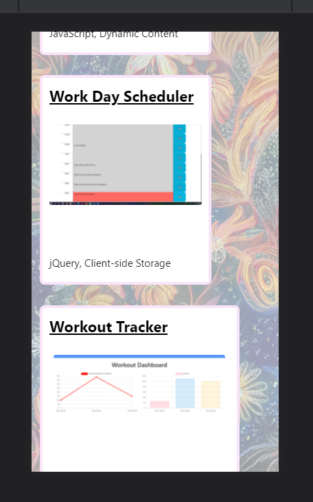

 # React Portfolio

## [Portfolio Site](https://matildabrantley.github.io/portfolio-react/)
### [My GitHub](https://github.com/matildabrantley)
## Table of Contents:
* [Projects](#projects)
* [License](#license)
* [Questions](#questions)
## Description
My portfolio refactored with React and React-Spring

## Projects
* LEaseGIT - Sequelize, Express, Matter
    * Post or search for real estate for sale, use room planner to stage a property or see how your furniture might fit
* Brewhaha - OpenBrewery & Wikipedia APIs
    * Plan a trip, search for breweries, search Wikipedia for cities and states with filtered and curated results 
* Password Generator - JavaScript
    * Generates passwords from user prompts
* E-Commerce Back-End - Node, MySQL, Sequelize (Object-Relational Mapping)
    * Interact with a complete E-Commerce back-end through a REST API client (such as Insomnia or Thunder Client)
* Employee Tracker - Node, Inquirer, MySQL
    * Content Management System for tracking employees implementing C.R.U.D. in MySQL database
* Weather Dashboard - OpenWeather API
    * Retrieve and display weather data for cities from OpenWeather
* Coding Quiz - jQuery, Dynamic Content
    * Take a quiz on the web about basic coding knowledge
* Work Day Scheduler - jQuery, Client-side Storage
    * Plan upcoming activities on a color-coded hourly basis
* Workout Tracker - NoSQL with MongoDB, Express, Chart.js
    * Keep track of your fitness using Mongo database.
* Book Search Engine - M.E.R.N Stack, Google Books API
    * Full stack search engine for books using Google Books API.
## Screenshots

React-Spring used to lift up card from page

Styles subtly shift based on mouse position

Mobile responsiveness

## License
The project is licensed under the MIT License license.
## Questions
Questions about the project may be directed to my email at matildahbrantley@gmail.com.
Here is a link to [my GitHub](https://github.com/matildabrantley) 
for access my other work.
