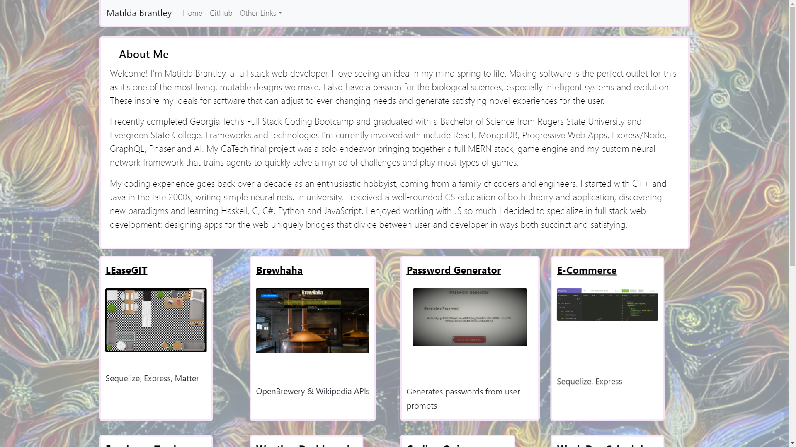

 # React Portfolio

## [Portfolio Site](https://matildabrantley.github.io/portfolio-react/)
### [My GitHub](https://github.com/matildabrantley)
## Table of Contents:
* [Projects](#projects)
* [License](#license)
* [Questions](#questions)
## Description
My portfolio refactored with React

## Projects
* LEaseGIT - Sequelize, Express, Matter
* Brehaha - OpenBrewery & Wikipedia APIs
* Password Generator - Generates passwords from user prompts
* E-Commerce Back-End
* Employee Tracker - Node, Inquirer
* Weather Dashboard - OpenWeather API
* Coding Quiz - jQuery, Client-side Storage
* Work Day Scheduler 
## Screenshots

## License
The project is licensed under the MIT License license.
## Questions
Questions about the project may be directed to my email at matildahbrantley@gmail.com.
Here is a link to [my GitHub](https://github.com/matildabrantley) 
for access my other work.
